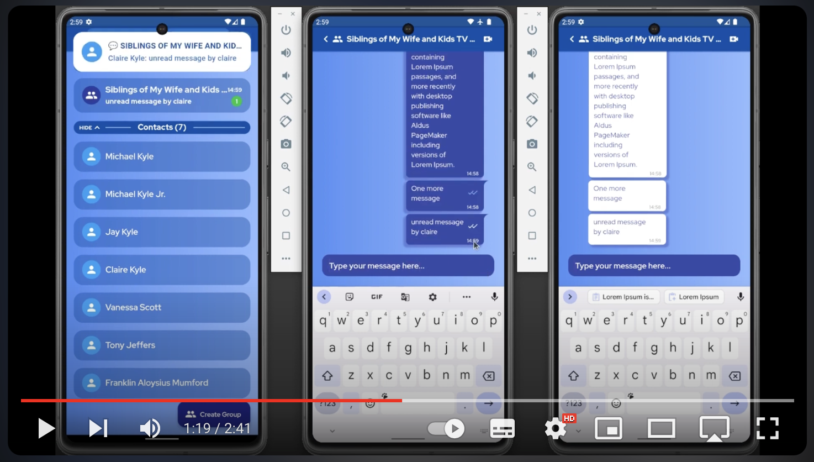

# Flutter Group Chat App with Firebase
A complete Flutter Group Chat App with Firebase that supports video calls. 
It handles typing, received and read indicators, Group Management, closed app and opened app notifications,
security, account creation, login, mutex for generating the numeric Agora UID and more.

- Firebase Cloud Messaging (FCM) is used to send push notifications when the user sends a new message or joins a video call.
- Firebase Cloud Functions: The backend that handles the Agora token request so the user can join the call. It also runs triggers when a Firestore document changes, like sending push notifications when a new message is created.
- Video Calls are handled with [Agora](https://console.agora.io/projects), the package `agora_rtc_engine` is used to handle video calls, `agora_uikit` is used for the video call screen layout.
- Firestore Security Rules: `firestore.rules` file contains rules like: only admins can add users to the group, users can only see public data of other users, etc.
- Firestore Indexes: `firestore.indexes.json` file contains the Firestore indexes.

## 🎥 [Click here to open the video](https://www.youtube.com/watch?v=dAo8S8eUIaM)

|                    | Android | iOS | Web |
|:-------------------|:-------:|----:|----:|
| Video Calls        |    ✅    |   ✅ |   ❌ |
| All other features |    ✅    |   ✅ |   ✅ |

## Getting Started

### Step 1:

To get started, open the terminal in the `flutter_app` folder.

Go to your Firebase project > Click on the Engine ⚙️ button right to "Project Overview" > Copy your *Project ID*
Follow the instructions of **Add Firebase to your Flutter app** and run these two commands inside the `flutter_app`
folder, replace `paste-your-project-id-here` with your own Project ID.

    dart pub global activate flutterfire_cli
    flutterfire configure --project=paste-your-project-id-here

Go to your Firebase Console > Build > Authentication > Get Started > Sign-in method > Email/Password and enable Email/Password and save it.

Go to your Firebase Console > Build > Firestore Database > Create database. You can choose any option (`Start in production mode` or `Start in test mode`), it's not important because we will update the security rules in the following steps.

### Step 2: Push notifications (optional)

iOS and Web platforms require additional configuration for Firebase Cloud Messaging (FCM),
so you can show push notifications when a user receives a new text message.

#### iOS

[Follow these instructions on iOS](https://firebase.flutter.dev/docs/messaging/apple-integration/).

#### Web
A **vapidKey** is required for web.

1. Get your vapidKey on the Firebase Console, you can check the [instructions here](https://stackoverflow.com/a/54996207/4508758).
2. Go to the file `flutter_app/lib/core/domain/services/notifications_service.dart`
3. Replace the value of `_vapidKeyForWeb` with your own vapidKey

**Set the environment** on the `web/environment` file:

4. Copy the values from `web` field in the `flutter_app/lib/firebase_options.dart` file
5. Paste the values in the `flutter_app/web/environment.js` file

### Step 3: Video Calls (optional)

#### Supported platforms

1. Create your [Agora account](https://console.agora.io/projects), go to the [projects page](https://console.agora.io/projects) and click on "Create a Project"
2. Under "Authentication" choose the **Secured mode: APP ID + Token (Recommended)** option
3. Copy the **App ID** value and save in your notepad so that we can use later
4. Click on "Configure"
5. On "App Certificate", copy the **Primary Certificate** value as well
6. Go to `functions/environment.ts` and set the Agora App ID and App Certificate.
7. Go to `flutter_app/lib/environment.dart` and set only the Agora App ID there.

:warning: Do not expose your App Certificate

### Step 4: Deploying

- Run `npm install -g firebase-tools` to install the Firebase CLI
- Run `firebase use --add` and select your Firebase project, add any alias you prefer
- Optional: In case you prefer not deploying to web, go to `firebase.json` file and remove the `hosting` object
- And finally, run `firebase deploy`, so the firestore security rules will be updated, cloud functions and indexes will be created.

## Getting in touch

Feel free to open a GitHub issue about:

- :grey_question: questions

- :bulb: suggestions

- :ant: potential bugs

## License

[MIT](LICENSE)

## Contacting me

📧 rodrigo@wisetap.com
